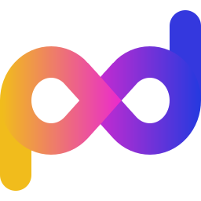

# My Period Data Is Mine!

   

Your personal data should be yours and yours only; especially if it is as personal as your period data.

I wouldn’t want my boss to know when I menstruate, just as I wouldn’t want to know when my neighbours have their periods. Each individual should own that information and control who they share it with and when.

The current problem we are facing is that this information – when synced with the cloud, whether it’s encrypted or not – is no longer within our control, and therefore it’s no longer private. This information can be, and is being used against us. If your period is late, some authorities may – and do – ask themselves whether you had an illegal abortion.

**We urgently need to regain control over our period data!**

## My Period Data Is Mine! – Project goals

### 1. Data remains on your phone

We need your help to build a period tracker which keeps your data on your phone and on your phone only – no transfers into the cloud; no handing over your data for “legal” reasons; no pseudo-anonymous handling of your data for unknown analysis; and no ads or other third parties tracking your app usage.

### 2. Local encryption

The data on your phone must be encrypted so that even if someone has your phone in their hands, they won’t be able to access your data unless you give them your **My Period Data Is Mine!** passcode. Law enforcement won’t be able to use backdoors to “legally” access your data unless you give them permission.

### 3. User design and translations

We need help from people all over the world to provide user design and translations. We want everyone to feel that the app is easy to use and remember to use it every day.

In addition to the above, we welcome input and feedback from potential users to ensure we build what you want and need!

### 4. Free for everyone

The **My Period Data Is Mine!** period tracker will be free to download and use for everyone, forever. Everyone should be able to access the **My Period Data Is Mine!** period tracker irrespective of financial resources.

**Join us in making this world better for everyone!**

Find more information on [www.myperioddataismine.com](https://myperioddataismine.com/).
